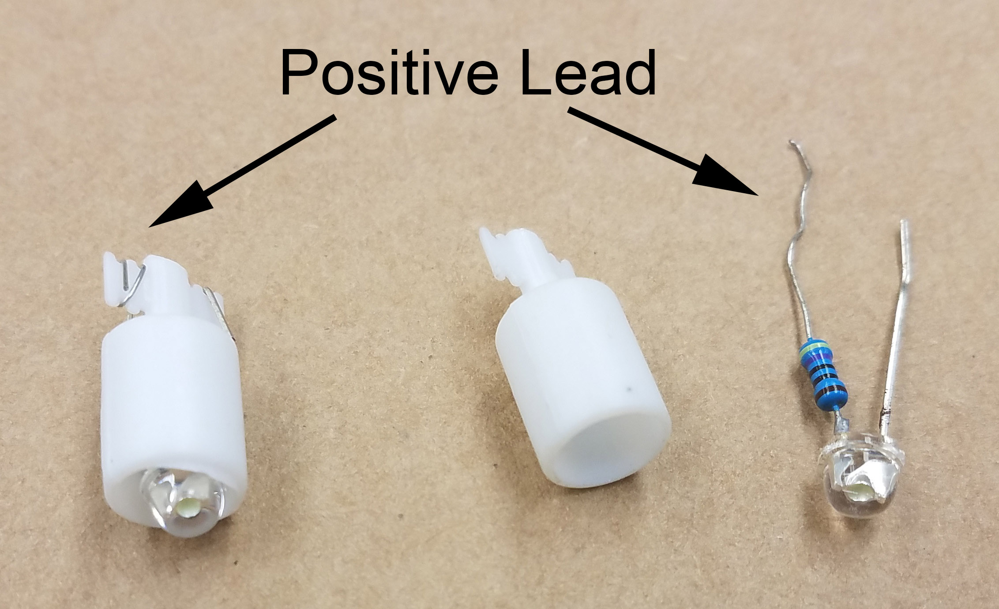

# A DIY SDVX/K-Shoot Mania Controller Guide (Work-In-Progress)
#### Last Updated: 5/10/2018

# Table of Contents  

* [About SDVX](#about-sdvx)
* [Controller Options](#controller-options)
* [Equipment List](#equipment-list)
* [Parts List](#parts-list)
* [Electrical Assembly](#electrical-assembly)

# About SDVX  
Sound Voltex is a rhythm game that originated in Japan. It mixes the standard top down four column layout of other rhythm games along with two additional columns which overlap on columns 1/2 and columns 3/4. It also incorporates two effects sliders which cross the playing field. Sound Voltex arcade machines are playable in Japan and in the United States through Round1. A PC application available for most countries as [Sound Voltex III e-AMUSEMENT CLOUD](https://p.eagate.573.jp/game/eacsdvx/iii/p/common/top.html).  

K-Shoot Mania is the main alternative to SDVX and is free to play and supports a wide variety of  input control schemes. The K-Shoot Mania Project can be found [here]().

# Controller Options  
Before you decide to build your own controller, it may be worthwhile comparing existing options. Building your controller is a rewarding experience but will often cost as much or more than commercial controllers, especially if you don't already have access to the necessary tools.

 * [Gamo2 SVSE5](https://www.gamo2.com/en/index.php?dispatch=products.view&product_id=314)
 * [Gamo2 SVRE9](https://www.gamo2.com/en/index.php?dispatch=products.view&product_id=313)
 * [Pocket Voltex](https://mon.im/sdvx/)

# Equipment List
One of the biggest obstacles to actually building the controller is having access to the necessary equipment. If you don't have access to the equipment at home or at a university, check to see if there's a hacker space nearby which might have the equipment you need.

If you have access to computerized equipment such as a laser cutter, you will be able to cut square holes and recess the buttons into the top plate of the controller. If you only have access to standard wood working tools, the buttons will have to sit on top of the top plate which only affects aesthetics and not performance.

#### Recessed Button Build:
 * Laser Cutter or CNC Mill
 * Soldering Iron
 * Spade Crimping Tool (or pliers)
 * Wire Cutter

#### Non-Recessed Button Building
 * Table Saw
 * Drill Press
 * Soldering Iron
 * Spade Crimping Tool (or pliers)
 * Wire Cutter

# Parts List

For most builds, I would recommend using Chinese clones over official Sanwa parts due to the steep cost of Sanwa parts. The parts which affect gameplay performance the most are the limit switches and the optical rotary encoders.

Some parts in the parts list can be substituted with other parts depending on your preferences. Please read the [limit switch weighting](#choosing-your-limit-switch-weight) section to determine which limit switch weighting is right for you.

#### Full Sized Controller ($140 w/Clones):  

 * $20.00 4x [60mm Square Arcade Buttons](https://www.aliexpress.com/item/high-quality-4pcs-lot-Square-60-60mm-Lighted-Buttons-Illuminated-Push-Button-with-Micro-switch-for/32611880107.html)
 * $8.00 2x [45mm Rectangular Arcade Buttons](https://www.ebay.com/itm/Long-Rectangle-LED-Illuminated-Push-Button-For-Arcade-Video-Machines-50-33mm-Lot/263040766497?_trkparms=aid%3D111001%26algo%3DREC.SEED%26ao%3D1%26asc%3D20131017132637%26meid%3D00125b674abb4125b46ee52f972cf060%26pid%3D100033%26rk%3D8%26rkt%3D8%26sd%3D292485342918%26itm%3D263040766497&_trksid=p2045573.c100033.m2042)
 * $1.50 1x [33mm Square Arcade Buttons](https://www.ebay.com/itm/33mm-Square-Arcade-Game-Machine-Push-Button-LED-illuminated-Blue-MicroSwitch-New/292485342918?hash=item44197c26c6:g:GsQAAOSwhQtaqfX7)
 * $10.00 1x [Arduino Micro](https://www.ebay.com/itm/Micro-Board-for-Arduino-Leonardo-Mini-Controller-5V-16-MHz-ATmega32u4-Module/311838264471?epid=2266061069&hash=item489b024c97:g:LSMAAOSwWxNYtOYB)
 * $7.50 1x [Arduino Micro Breakout](https://www.ebay.com/itm/Screw-Terminal-Breakout-PCB-for-Raspberry-Pi-GPIOs-Arduino-Nano-Micro-more/142737397889?hash=item213bcfd881:m:mwdoB9ogbUTo15wtXr29XkQ)
 * $10.00 4x [100g Basic Limit Switches (Optional but Recommended)](https://www.mouser.com/ProductDetail/Omron-Electronics/D3V-6-1C24-K-6?qs=sGAEpiMZZMumBvQ1hY%2ffBTSaeneFcwBtDuZRREEUu%252bI%3d)
 * $6.00 3x [50g Basic Limit Switches (Optional but Recommended)](https://www.mouser.com/ProductDetail/Omron-Electronics/D3V-01-3C23-K?qs=%2fha2pyFadujjWXGU5Rf3WcnMSR61eELcAh360%2f3s2kY%3d)
 * $7.50 1x [100pc Spade Connector (Optional but Recommended)](https://www.ebay.com/itm/100Pcs-Fully-Insulated-Blue-Female-Electrical-Spade-Crimp-Connector-Terminal-New/182753468067?ssPageName=STRK%3AMEBIDX%3AIT&_trksid=p2057872.m2749.l2649)
 * $20.00 2x [Optical Rotary Encoders](https://www.ebay.com/itm/Encoder-400P-R-Incremental-Rotary-Encoder-400p-r-AB-phase-encoder-6mm-Shaft/262600476946?ssPageName=STRK%3AMEBIDX%3AIT&_trksid=p2057872.m2749.l2649)
 * $15.00 2x [6mm D-Shaft Aluminum Knobs](https://www.aliexpress.com/item/Diameter-38MM-Height-30-mm-Stalk-aluminum-knob-Volume-knob/32690174488.html)
 * $10.00 1x 48"x24"x1/4" Medium Density Fiberboard (Try to Source Locally)
 * $20.00 1x [18"x12"x1/4" Clear Acrylic (Optional & Try to Source Locally)](https://www.ebay.com/itm/CLEAR-ACRYLIC-PLEXIGLASS-1-4-X-12-X-24-PLASTIC-SHEET/281826160483?hash=item419e25ef63:g:w0IAAOSw20JZgOdh)
 * $5.00 1x [Micro USB B 2.0 Cable (May be included with Arduino)](https://www.amazon.com/AmazonBasics-Male-Micro-Cable-Black/dp/B07232M876/)

#### Full Sized Controller (Sanwa):

* 4x [60mm Square Sanwa Buttons]
* 2x [45mm IIDX Sanwa Buttons]
* 1x [33mm Square Sanwa Buttons]* 7x [Lamp Holder]
* 7x [LED Holder]
* 1x [Arduino Micro/Leonardo]
* $10.00 4x [100g Basic Limit Switches](https://www.mouser.com/ProductDetail/Omron-Electronics/D3V-6-1C24-K-6?qs=sGAEpiMZZMumBvQ1hY%2ffBTSaeneFcwBtDuZRREEUu%252bI%3d)
* $6.00 3x [50g Basic Limit Switches](https://www.mouser.com/ProductDetail/Omron-Electronics/D3V-01-3C23-K?qs=%2fha2pyFadujjWXGU5Rf3WcnMSR61eELcAh360%2f3s2kY%3d)
* 1x [100pc Spade Connector (Optional)]
* 2x [Optical Rotary Encoders]
* 2x [6mm D-Shaft Aluminum Knobs]
* 1x [48"x24"x1/4" Medium Density Fiberboard]
* 1x [18"x12"x1/4" Clear Acrylic (Optional)]
* 1x [Micro USB B 2.0 Cable (May be included with Arduino)]

#### Possible Part Substitutions:
 * 2x [PEC16 Mechanical Encoder (Replace Optical Encoder)]
 * 4x [0.1uF Capacitors (Required for Mechanical Encoder)]
 * 7x [25g Basic Limit Switch (Use if Keeping Button Return Spring)]

#### Choosing Your Limit Switch Weight
Arcade buttons will usually ship as a preassembled unit. There are two main configurations which you can setup your arcade buttons as. This guide by default opts to remove the return spring from the button and rely solely on the return force of the limit switch to reset the button. This option provides a light actuation force and a tactile, clean break when the switch is triggered. The other option is to retain the return spring and use a very lightly weighted limit switch. This configuration relies on the return spring to reset the button and provides a heavy, consistent actuation force even after the switch is triggered. Button weighting with the return spring can be reduced by cutting the main return spring.

The limit switches which typically come with the arcade buttons have an actuation force of 150g to 200g. If you are planning to remove the return spring, you should test the button without the return spring and with the switches that came with the button before you buy aftermarket switches to replace it. Depending on your preferences, the default switches may suffice.

#### Custom Button Weighting
This chart displays the weight of the individual parts of the button which the switch must act against and the minimum force buffer that you must maintain for correct operation. The actuation force is roughly the summation of the return spring and the actuation force of the limit switch. The minimum actuation force required is a suggestion however choosing a lower actuation force will result in buttons which return slowly creating a sluggish feel.

Official Sound Voltex Arcade machines do not have a universal weighting for the buttons and often vary between arcades.

| Button Size | Plunger Weight | AF* w/Spring | AF* w/Spring & 25g Switch | Minimum Switch AF* Required |
|:-------------:|:-------------:|:-------------:|:-------------:|:-------------:|
| 60mm Square   | 22g           | 290g          | 330g          | 100g          |
| 45mm Rectangle| 7g            | 150g          | 180g          | 75g           |
| 33mm Square   | 3g            | 150g          | 170g          | 50g           |

AF*: Actuation Force  

# Electrical Assembly
#### Arcade Button Return Spring Removal
#### Switch & LED Lamp Wiring
Arcade buttons usually ship with a lamp holder, LED fixture and LED. The LED will either be white or the same color as the button cap. Most of the LED fixtures and LEDs that ship with the arcade buttons will have a resistor soldered to the LED in the fixture. This allows the LED to be driven directly off 12V without a resistor. Since we will be driving the LED directly off the output pin of an Arduino, the LED will be dimmer than intended. The LEDs chosen for the guide are a flat topped variety which offers the best illumination pattern within the square button and can be driven directly off the 5V output pin without an external resistor.

  
   
  Assembled LED & Holder (left) & Disassembled (right)

#### Rotary Encoder Wiring
#### Arduino Wiring

# Programming
#### Installation
#### Downloading the Code

# Box Assembly
